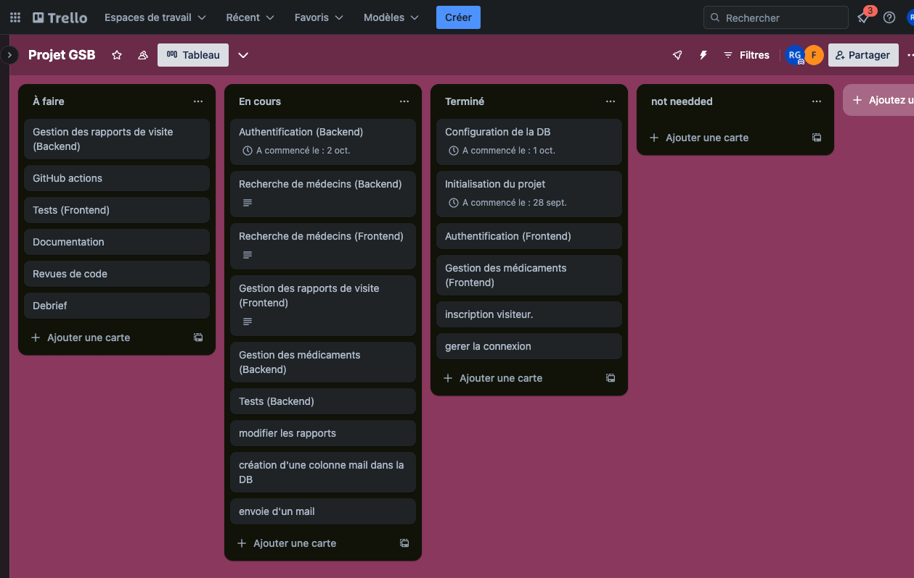
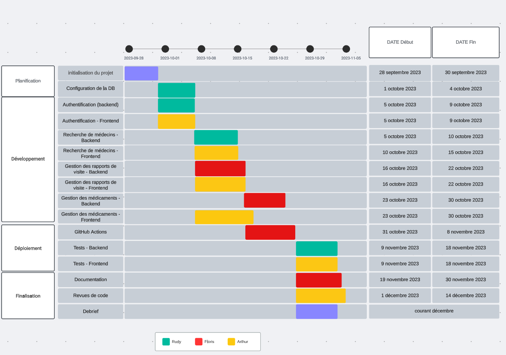
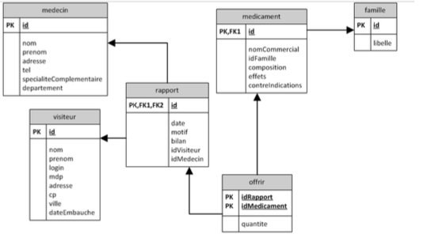
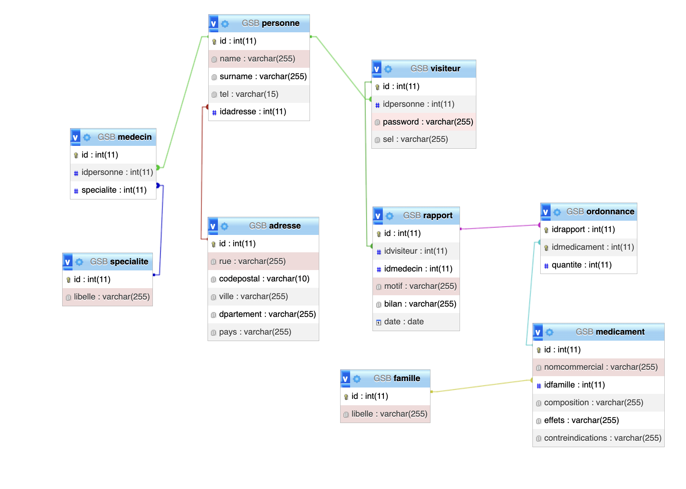
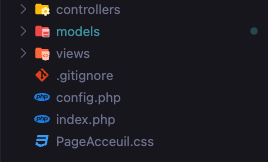
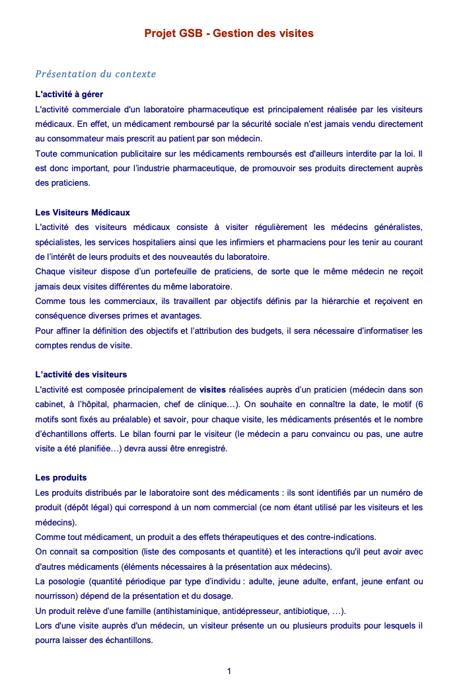
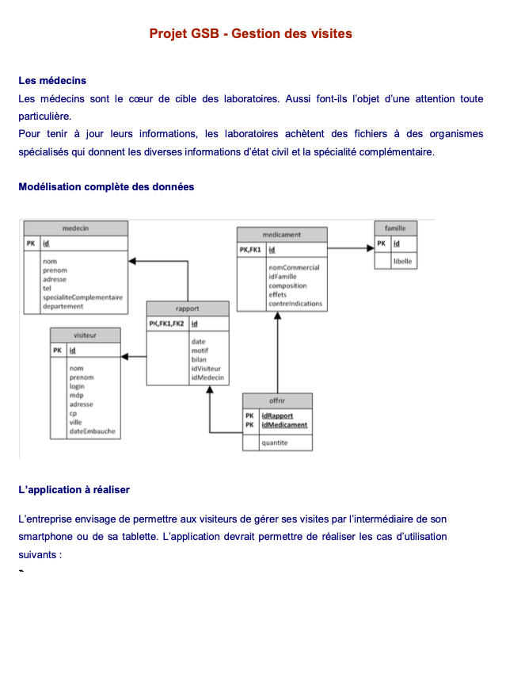
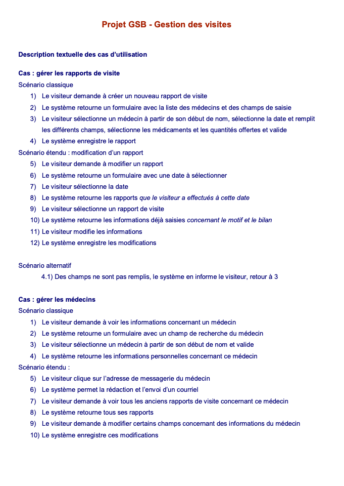

Projet GSB - Gestion des visites
[Retrouvez ici le document complet du projet.](../../../public/assets/1-Projet-GSB-Gestion-Visites.pdf)

Github du projet: https://github.com/ECG-Rudy-Glt/Projet-GSB---Gestion-des-visites.git

# Rapport de Projet BTS SIO - Gestion des Visites GSB  

 

## Résumé  du projet 

Dans le cadre de notre formation BTS Services Informatiques aux Organisations, notre équipe de trois, réduite finalement à deux, a entrepris de développer une application web pour le sénario fictif d’un laboratoire GSB afin de numériser le processus de gestion des visites médicales. 

L'application a été conçue en utilisant PHP et le modèle d'architecture MVC, avec l'objectif d'améliorer l'efficacité des visiteurs médicaux en leur permettant de créer, modifier et consulter des rapports de visite sur une interface numérique. Ce projet a impliqué une planification méticuleuse, une gestion agile des tâches, et un développement itératif avec des phases de tests rigoureux. En dépit de quelques obstacles, notamment une réduction des ressources humaines, le projet a été mené à terme avec succès, fournissant une solution fonctionnelle qui promet d'augmenter la productivité et la précision des données pour GSB.  

 

## Introduction  

 

Ce rapport documente le développement de l'application de gestion des visites pour le laboratoire GSB. Réalisé dans le cadre du BTS Services Informatiques aux Organisations, ce projet a pour but de créer une solution pour les visiteurs médicaux afin de numériser et optimiser leurs activités quotidiennes. 

  

## Membres de l'équipe 

  

- Gault Rudy 

- Floris Sejourné 

- Arthur Brunel 

  

## Objectifs du projet 

  

- Développer une application en PHP suivant l'architecture MVC. 

- Permettre aux visiteurs médicaux de gérer leurs visites et rapports de manière numérique. 

- Améliorer l'efficacité des suivis de visite. 

  

## Méthodologie 

  

Pour mener à bien ce projet, nous avons adopté une méthode de travail Agile, en utilisant le tableau Kanban pour la gestion des tâches et le diagramme de Gantt pour la planification temporelle. 

  

 

*Figure 1: Tableau Kanban Agile utilisé pour le projet.* 

  

 

*Figure 2: Diagramme de Gantt illustrant la planification du projet.* 

 

 

 

## Conception de la Base de Données 

  

L'un des aspects clés de notre projet était la conception d'une base de données robuste et efficace. Nous avons commencé avec un MCD de base qui nous a été fourni au début du projet. Au cours du développement, nous avons identifié plusieurs domaines d'amélioration qui nous ont permis d'optimiser notre modèle. 

  

### Modèle Conceptuel de Données Initial 

  

 

*Figure 3: Le Modèle Conceptuel de Données initial fourni pour le projet.* 

  

### Améliorations apportées 

  

Nous avons apporté plusieurs modifications pour améliorer la structure et les relations de la base de données. Ces changements ont inclus l'ajout de nouvelles entités, la modification des attributs pour une meilleure normalisation, et l'ajustement des relations pour faciliter les requêtes et améliorer les performances. 

  

 

*Figure 4: Le Modèle Conceptuel de Données amélioré développé par notre équipe.* 

  

Les modifications spécifiques que nous avons apportées incluent :

- **Normalisation des adresses** : Création de l'entité `GSB_adresse` pour séparer les adresses dans une table distincte, éliminant ainsi les données redondantes et facilitant la gestion des mises à jour.

- **Introduction de la table `GSB_specialite`** : Ajout d'une nouvelle table pour gérer les spécialités médicales, permettant une association plus structurée des médecins avec leurs spécialités.

- **Refonte de la relation entre médecins et visiteurs** : Établissement d'une relation directe entre les médecins et les visiteurs via la table `GSB_rapport`, pour un suivi simplifié des interactions.

- **Sécurisation des authentifications** : Dans la table `GSB_visiteur`, ajout de champs pour le mot de passe et le sel, renforçant la sécurité des données d'authentification.

- **Gestion des ordonnances** : Création de la table `GSB_ordonnance` pour lier les rapports aux médicaments prescrits, reflétant une meilleure gestion des données médicales.

- **Amélioration des informations médicamenteuses** : Enrichissement de la table `GSB_medicament` avec des détails sur la composition, les effets et les contre-indications des produits.

- **Optimisation des clés** : Amélioration de la structure des clés primaires et étrangères pour assurer une intégrité référentielle robuste à travers la base de données.

Ces améliorations structurelles ont permis d'augmenter la flexibilité, la sécurité, et l'efficacité de la gestion des données, tout en préparant la base pour une éventuelle montée en charge et des besoins futurs en évolution.

 

 

  

## Développement 

  

### Backend 

  

Le backend de l'application a été développé en PHP en suivant le modèle MVC. Les fonctionnalités implémentées incluent l'authentification, la gestion des rapports de visite, et la manipulation des données médicales. 

  

 

*Figure 3: Exemple de code backend PHP MVC.* 

  

### Frontend 

  

Le frontend a été conçu pour offrir une expérience utilisateur fluide et intuitive, en utilisant HTML, CSS. 

  

 

*Figure 4: Capture d'écran de l'interface utilisateur de l'application.* 

  

## Tests 

  

Des tests ont été effectués à la fois pour le backend et le frontend pour assurer la fiabilité de l'application. 

  

## Conclusion 

  

Le projet a réussi à fournir une solution efficace pour la gestion des visites médicales. Malgré quelques défis, notamment la réduction de l'équipe de travail, l'application répond aux besoins exprimés par GSB. 

  

## Annexes 

  
 

 
 
 
